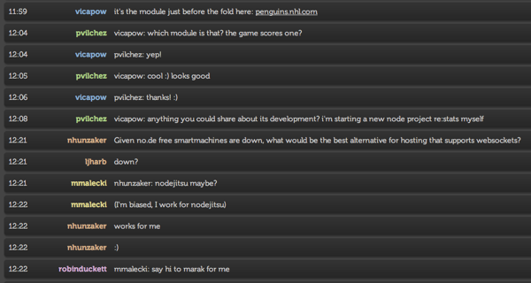

# Pastel LimeChat Theme
This is a custom theme I threw together using pastel colors. It is still a work in progress but I thought I would throw it up so others can download or build off of it.

## Install
In order to install the theme just download the files and put them in ~/Library/Application Support/LimeChat/ You choose the Pastel theme from LimeChat preferences. 